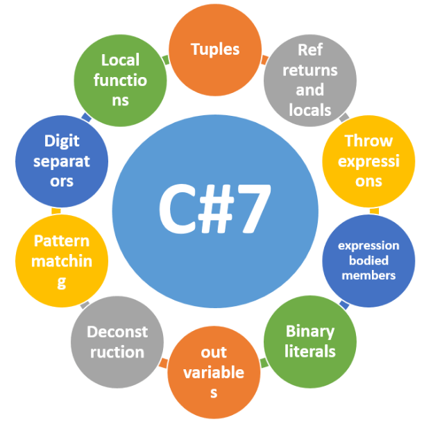
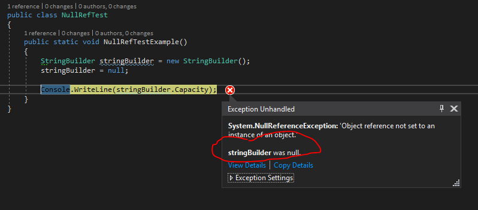

# C#7 new Features

## Features
* [Tuples](CSharp7Console/01Tuples.cs)
* [Deconstruction of Tuples](CSharp7Console/02Deconstruction.cs)
* [Local Functions](CSharp7Console/03LocalFunctions.cs)
* [Out Params](CSharp7Console/04OutParams.cs)
* [Pattern Matching](CSharp7Console/05PatternMatching.cs)
* [Binary Literals and Separaters](CSharp7Console/07BinaryLiteralsAndSeparaters.cs)
* [Null Reference Exceptions](CSharp7Console/06NullRefTest.cs) 

#####  Didn't make C#7
* [Expression Body Members](CSharp7Console/100ExpressionBodyMembers.cs)
* [Ref Types](CSharp7Console/101RefTypes.cs)
* [Throw Exception](CSharp7Console/102ThrowException.cs)
* [Constructors](CSharp7Console/103Constructors.cs)

## Useful articles
*  **Microsoft annoucment of whats in C# 7 [https://blogs.msdn.microsoft.com/dotnet/2017/03/09/new-features-in-c-7-0/](https://blogs.msdn.microsoft.com/dotnet/2017/03/09/new-features-in-c-7-0/)**
*  [Build Rosyln on VS2015](http://www.c-sharpcorner.com/article/how-to-compile-test-C-Sharp-7-features/)
*  [Mad's channel 9 video](https://channel9.msdn.com/Events/Connect/2016/105)
*  [Mad's accompanying blog post](https://blogs.msdn.microsoft.com/dotnet/2016/08/24/whats-new-in-csharp-7-0/)
*  [Top 10 features](http://www.c-sharpcorner.com/article/top-10-new-features-of-c-sharp-7-with-visual-studio-2017/)
*  [How/Why](https://www.kenneth-truyers.net/2016/01/20/new-features-in-c-sharp-7/)
*  [Future of C# - Channel  9, early post on C#7 from Build  2016](https://channel9.msdn.com/Events/Build/2016/B889)

